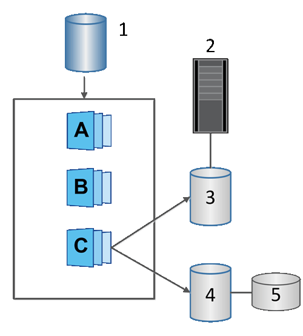

= Volúmenes Snapshot
:allow-uri-read: 
:icons: font
:imagesdir: ../media/

[role="lead"]
Es posible crear un volumen Snapshot y asignarlo a un host para leer o escribir datos Snapshot. El volumen Snapshot comparte las mismas características que el volumen base (nivel de RAID, características de I/o, etc.).

Al crear un volumen Snapshot, es posible designarlo como __Read-onl__y o _Read-write Accessible_.

Cuando se crean volúmenes Snapshot de solo lectura, no es necesario añadir capacidad reservada. Cuando se crean volúmenes Snapshot de lectura/escritura, es necesario añadir capacidad reservada para proporcionar acceso de escritura.

^1^ Volumen base; ^2^ Host; ^3^ Volumen Snapshot de solo lectura; ^4^ Volumen Snapshot de lectura/escritura; ^5^ Capacidad reservada
